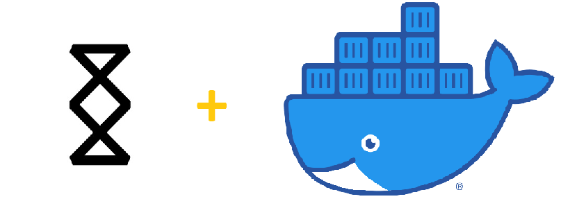

# Docker container for SMAPP
[](https://hub.docker.com/r/furritos/docker-smapp/tags)

This project takes the standalone **Spacemesh + Wallet** application and transforms into portable, web-accessible 
container using Docker and noVNC.

---

[](https://spacemesh.io/)
**Spacemesh App** is  desktop application for Windows 10, OS X and Linux, now in a Docker container, which includes a Smesher and a basic wallet. 

---

## Quick Start

**NOTE**: The Docker command provided in this quick start is given as an example and parameters 
should be adjusted as needed.

First, clone this repository:
```
git clone https://github.com/furritos/docker-smapp.git
cd docker-smapp
```

Launch the **SMAPP** Docker container with the following, Linux and PowerShell compatible, command:
```
docker run -d \
  --name=container-smapp \ 
  -v ${pwd}/config:/root/.config/Spacemesh \
  -v ${pwd}/post:/root/post \
  -p 5800:8080 \
  furritos/docker-smapp
```
Finally, take your favorite web browse and open `http://localhost:5800`.
Please refer to this [Get Started](https://spacemesh.io/start/) page for more information on using **SMAPP**.

**NOTE:** By default, the resolution is set to `1440X900`.  To override these values, set resolution to `1680X1050`, the `docker run` command line would be:

```
docker run -d \
  --name=container-smapp \ 
  -v ${pwd}/config:/root/.config/Spacemesh \
  -v ${pwd}/post:/root/post \
  -p 5800:8080 \
  -e DISPLAY_WIDTH=1680 \
  -e DISPLAY_HEIGHT=1050 \
  furritos/docker-smapp
```

## Docker Basic Usage

```
docker run [-d] \
  --name=container-smapp \
  [-v <HOST_DIR>:<CONTAINER_DIR>[:PERMISSIONS]]... \
  [-p <HOST_PORT>:<CONTAINER_PORT>]... \
  [-e <VARIABLE_NAME>=<VALUE>]... \
  furritos/docker-smapp
```
| Parameter | Description                                                                                                                                               |
|-----------|-----------------------------------------------------------------------------------------------------------------------------------------------------------|
| -d        | Run the container in the background.  If not set, the container runs in the foreground.                                                                   |
| -v        | Set a volume mapping (allows to share a folder/file between the host and the container).  See the [Data Volumes](#data-volumes) section for more details. |
| -p        | Set a network port mapping (exposes an internal container port to the host).  See the [Ports](#ports) section for more details.                           |
| -e        | Pass an environment variable to the container. See the [Environment Variables](#environment-variables) section for more details.                          |

### Environment Variables

To customize some properties of this container, the following environment variables can be passed via the `-e` parameter (one for each variable).  Value of this parameter has the format `<VARIABLE_NAME>=<VALUE>`.

| Variable       | Description                                     | Default |
|----------------|-------------------------------------------------|---------|
|`DISPLAY_WIDTH` | Width (in pixels) of the application's window.  | `1440`  |
|`DISPLAY_HEIGHT`| Height (in pixels) of the application's window. | `900`   |

### Data Volumes

The following table describes data volumes used by the container.  The mappings
are set via the `-v` parameter.  Each mapping is specified with the following
format: `<HOST_DIR>:<CONTAINER_DIR>[:PERMISSIONS]`.

| Container path          | Permissions | Description                             |
|-------------------------|-------------|-----------------------------------------|
|`/root/.config/Spacemesh`| rw          | SMAPP configuration artifacts directory |
|`/root/post`             | rw          | Plot files to be used for mining        |

### Ports

Here is the list of ports used by the container.  They can be mapped to the host
via the `-p` parameter (one per port mapping).  Each mapping is defined in the
following format: `<HOST_PORT>:<CONTAINER_PORT>`.  The port number inside the
container cannot be changed, but you are free to use any port on the host side.

|  Host Port  | Container Port | Mapping to host | Description                                                                                         |
|-------------|----------------|-----------------|-----------------------------------------------------------------------------------------------------|
|     5800    |      8080      | Mandatory       | Port used to access the application's GUI via the web interface.                                    |
|     5900    |      5900      | Optional        | Port used to access the application's GUI via the VNC protocol.  Optional if no VNC client is used. |

### Changing Parameters of a Running Container

As can be seen, environment variables, volume and port mappings are all specified
while creating the container.

The following steps describe the method used to add, remove or update
parameter(s) of an existing container.  The general idea is to destroy and
re-create the container:

  1. Stop the container (if it is running):
```
docker stop container-smapp 
```
  2. Remove the container:
```
docker rm container-smapp 
```
  3. Create/start the container using the `docker run` command, by adjusting
     parameters as needed.

**NOTE**: Since all application's data is saved under the `${pwd}/config` folder in 
the host volume, destroying and re-creating a container is not a problem: nothing is lost
and the application comes back with the same state (as long as the volume mapping of
the `${pwd}/config` to `/root/.config/Spacemesh` folder remains the same).  The same is
also true for the `/root/post` directory.

## Docker Image Update

Because features are added, issues are fixed, or simply because a new version
of the containerized application is integrated, the Docker image is regularly
updated.  Different methods can be used to update the Docker image.

The system used to run the container may have a built-in way to update
containers.  If so, this could be your primary way to update Docker images.

An other way is to have the image be automatically updated with [Watchtower].
Whatchtower is a container-based solution for automating Docker image updates.
This is a "set and forget" type of solution: once a new image is available,
Watchtower will seamlessly perform the necessary steps to update the container.

Finally, the Docker image can be manually updated with these steps:

  1. Fetch the latest image:
```
docker pull furritos/docker-smapp
```
  2. Stop the container:
```
docker stop container-smapp 
```
  3. Remove the container:
```
docker rm container-smapp 
```
  4. Create and start the container using the `docker run` command, with the
the same parameters that were used when it was deployed initially.

[Watchtower]: https://github.com/containrrr/watchtower

### unRAID

For unRAID, a container image can be updated by following these steps:

  1. Select the *Docker* tab.
  2. Click the *Check for Updates* button at the bottom of the page.
  3. Click the *update ready* link of the container to be updated.

## Accessing the GUI

Assuming that container's ports are mapped to the same host's ports, the
graphical interface of the application can be accessed via:

  * A web browser:
```
http://<HOST IP ADDR>:5800
```

  * Any VNC client (must expose port first):
```
<HOST IP ADDR>:5900
```

## Shell Access

To get shell access to the running container, execute the following command:

```
docker exec -ti container-smapp sh
```

## Support or Contact

Having troubles with the container or have questions?  Please
[create a new issue].

[create a new issue]: https://github.com/furritos/docker-smapp/issues